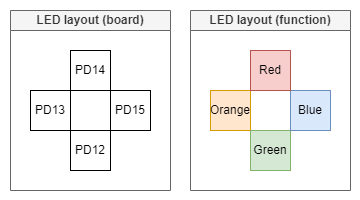
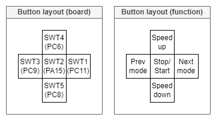
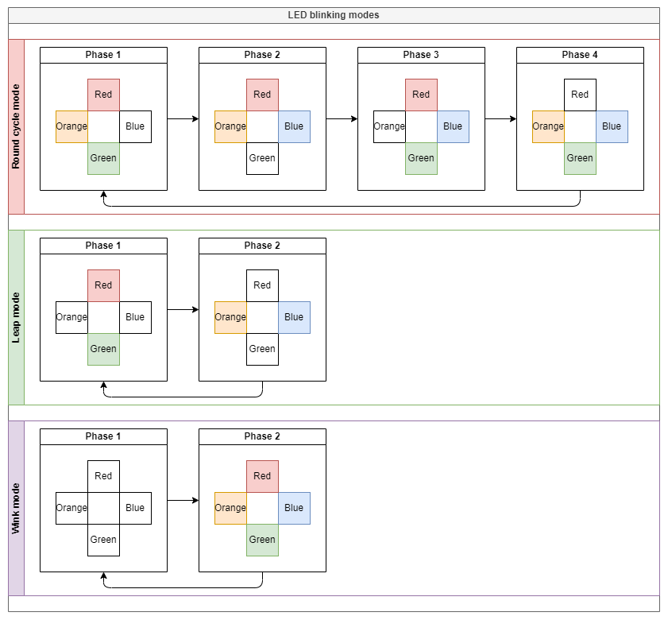
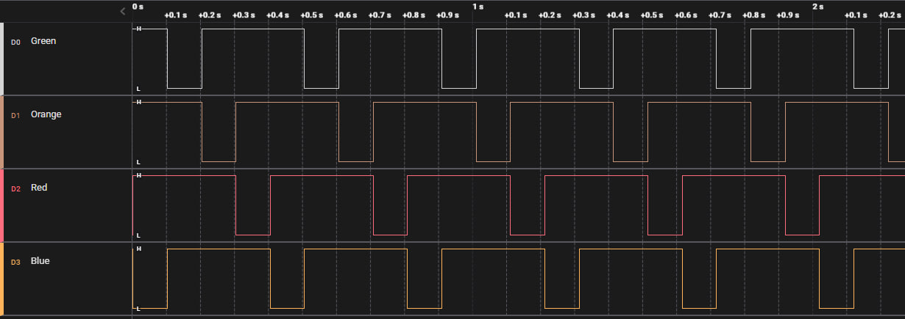
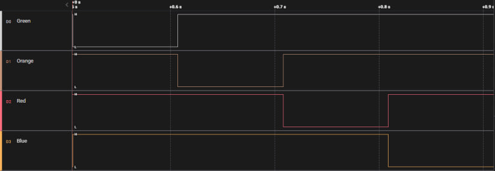

# GL_EmbeddedC_Metal
A set of tasks for C/Embedded on STM32F4DISCOVERY board and GL Extension board.

# Layouts

### LED layout

### Button layout

# Visualisation

### LED blinking modes

# Task_1 results:

For the 1st task I have implemented the "Round cycle" blink mode.

### Raw output

### Single cycle

/// vid

# Task_2 results:

For the 2nd task all 3 blink modes were implemented.

Button controls can be seen in the layout section.

/// vid