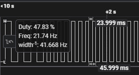

# GL_EmbeddedC_Metal
A set of tasks for C/Embedded on STM32F4DISCOVERY board and GL Extension board.

# Layouts

### LED layout

### Button layout (tasks 1 & 2)

### Button layout (task 3)

# Visualisation

### LED blinking modes

# Task_1 results:

For the 1st task I have implemented the "Round cycle" blink mode.

### Raw output

### Single cycle

### Demonstration
[Task 1 video link](https://drive.google.com/file/d/1ZAXTzUsTWDgzGQvHig82hiqvSF-8zatT/view?usp=sharing)

# Task_2 results:

For the 2nd task all 3 blink modes were implemented.

Button controls can be seen in the layout section.

### Demonstration
[Task 2 video link](https://drive.google.com/file/d/1ogUyGjm35eDtBWMlxWRxrAiMj8aUB_tE/view?usp=sharing)

# Task_3 results:

### Switching to High Speed External clock (frequency set to 16MHz)

After the clock is set, set the Prescaler (PSC) to 16000, resulting in an input frequency of 1 kHz.

### Blink frequency formula

Since we cannot change the Input signal frequency by adding an Additional frequency to it, we will find the formula for calculating the new Counter period value.

### System of equations of for Blink frequency with new and old Counter period values

### New Counter period value formula

### Duty cycle calculation

Calculating the duty cycle is very easy once you know the ARR value.

### Signal analyzer result table

| Input frequency | Additional frequency | ARRold | ARRnew | Duty cycle | Blink frequency | Signal Capture                                                         |
|:---------------:|:--------------------:|:------:|:------:|:----------:|:---------------:|:---------------------------------------------------------------------- |
| 1000 Hz         | 0 Hz                 | 250    | 250    | 50%        | 2 Hz            |    |
| 1000 Hz         | 5000 Hz              | 250    | ~42    | 50%        | 12 Hz           |  |
| 1000 Hz         | 10000 Hz             | 250    | ~23    | 50%        | 22 Hz           |  |
| 1000 Hz         | 0 Hz                 | 250    | 250    | 55%        | 2 Hz            |    |
| 1000 Hz         | 0 Hz                 | 250    | 250    | 60%        | 2 Hz            |    |
| 1000 Hz         | 0 Hz                 | 250    | 250    | 70%        | 2 Hz            |    |

### Demonstration
[Task 3 video link](https://drive.google.com/file/d/1F5gNPX0-D6QYBlSHwgrwUIJH9fl9PKEO/view?usp=sharing)
